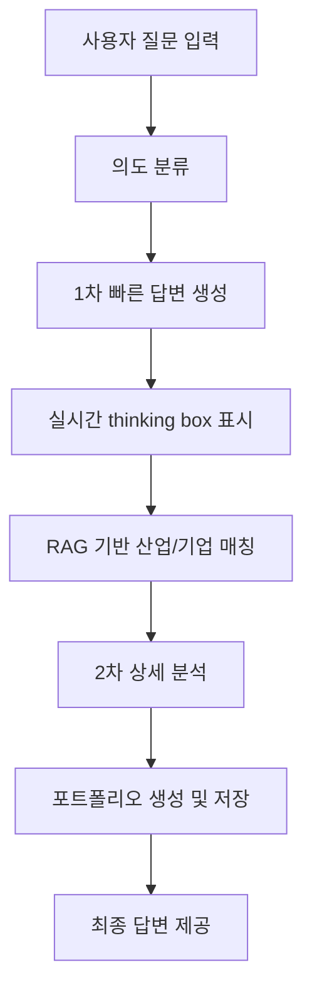
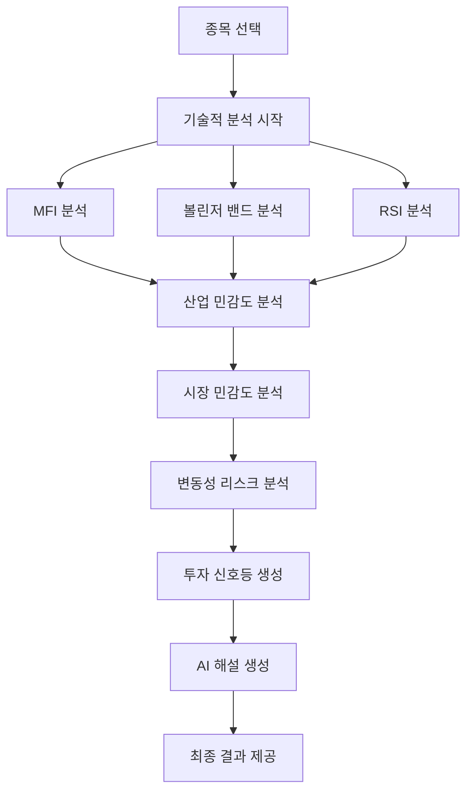
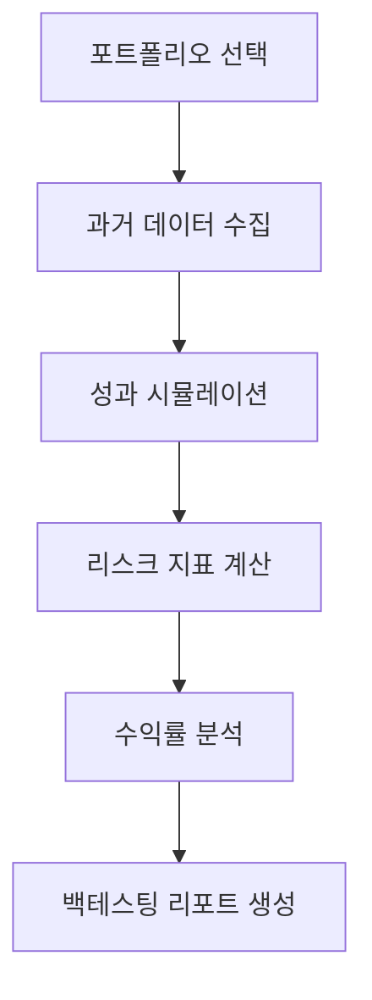

# AI 투자 분석 플랫폼

자연어로 질문하면 AI가 맞춤형 투자 전략을 제안하는 혁신적인 투자 분석 플랫폼입니다.

## 🚀 핵심 기능

### 1. 1차/2차 이중 응답 시스템
- **빠른 1차 답변**: 사용자 질문에 대한 즉시 응답 제공
- **상세한 2차 분석**: 심화 분석을 통한 정확하고 구체적인 투자 전략 제시
- **실시간 thinking box**: AI의 분석 과정을 실시간으로 시각화
- **의도 분류 및 페르소나 기반 응답**: 사용자 의도를 정확히 파악하여 맞춤형 답변 생성
- **RAG 기반 산업/기업 매칭**: 검색 증강 생성을 통한 정확한 정보 제공

### 2. 포트폴리오 저장 및 관리
- **자동 포트폴리오 저장**: AI 추천 포트폴리오를 자동으로 저장
- **그룹별 관리 시스템**: 포트폴리오를 그룹별로 체계적으로 관리
- **상세 분석 보고서**: 각 포트폴리오에 대한 상세한 분석 리포트 제공
- **포트폴리오 비교**: 여러 포트폴리오 간 성과 비교 분석

### 3. 포트폴리오 백테스팅
- **과거 성과 분석**: 과거 데이터를 기반으로 한 포트폴리오 성과 시뮬레이션
- **리스크 평가**: 포트폴리오의 위험도 분석 및 평가
- **수익률 시뮬레이션**: 다양한 시나리오에서의 수익률 예측
- **성과 지표 제공**: 샤프 비율, 최대 낙폭 등 주요 성과 지표 계산

### 4. SpeedTraffic 고급 분석
- **4단계 기술적 분석**:
  - MFI (Money Flow Index) 분석
  - 볼린저 밴드 (Bollinger Bands) 분석
  - RSI (Relative Strength Index) 분석
  - 종합 기술적 지표 분석
- **산업 민감도 분석**: 특정 산업의 시장 민감도 평가
- **시장 민감도 및 변동성 리스크 분석**: CAPM 및 GARCH 모델을 활용한 리스크 분석
- **AI 해설 및 투자 신호등**: 분석 결과를 직관적인 신호등으로 표시하고 AI가 상세 해설 제공

## 🏗️ 시스템 아키텍처

### 기술 스택
- **프론트엔드**: Next.js 15, React, TypeScript, Tailwind CSS
- **백엔드**: Node.js API Routes, Python 분석 서비스
- **AI/ML**: OpenAI GPT-4, RAG (Retrieval-Augmented Generation), LSTM, GARCH 모델
- **데이터**: KOSPI 상장 기업 데이터, 실시간 주가 데이터, 뉴스 데이터

### 모듈화된 AI 채팅 시스템
AI 채팅 시스템은 모놀리식 구조에서 모듈화된 구조로 리팩토링되어 유지보수성과 확장성을 크게 향상시켰습니다.

```
src/lib/ai-chat/
├── types.ts                    # TypeScript 타입 정의
├── config.ts                   # 설정 상수 및 패턴
├── session-manager.ts          # 세션 상태 관리
├── ai-service.ts              # (OpenAI 호환) Clova api
├── rag-service.ts             # RAG, 임베딩, 산업 매칭
├── company-utils.ts           # 회사 조회 및 유틸리티
├── pipeline-handlers.ts       # 단계별 로직 핸들러
├── request-handler.ts         # 메인 요청 오케스트레이션
└── index.ts                   # 공개 API 내보내기
```
 
## 🛠️ 설치 및 실행

### 필수 요구사항
- Node.js 18.0 이상
- Python 3.8 이상
- OpenAI API 키

### 설치
1. **저장소 클론**
   ```bash
   git clone https://github.com/Plokies-2/AIfestival.git
   cd AIfestival
   ```

2. **Node.js 의존성 설치**
   ```bash
   npm install
   ```

3. **Python 패키지 설치**
   ```bash
   pip install -r requirements.txt
   ```

4. **환경 변수 설정**
   ```bash
   # .env.local 파일 생성
   OPENAI_API_KEY=your_openai_api_key_here
   ```

### 로컬 실행
```bash
npm run dev
```
브라우저에서 `http://localhost:3000`에 접속하여 플랫폼을 이용할 수 있습니다.

## 🔄 AI 파이프라인

### 1차/2차 이중 응답 시스템 파이프라인


### SpeedTraffic 분석 파이프라인


### 포트폴리오 백테스팅 파이프라인


## 📊 데이터 플로우

### AI 채팅 시스템 데이터 플로우
1. **요청 수신**: 사용자 질문이 `/api/ai_chat` 엔드포인트로 전송
2. **세션 관리**: 대화 컨텍스트 유지 및 상태 관리
3. **의도 분류**: RAG를 활용한 사용자 의도 파악
4. **RAG 처리**: 벡터 임베딩을 통한 관련 정보 검색
5. **응답 생성**: 페르소나 기반 맞춤형 답변 생성
6. **포트폴리오 처리**: 추천 포트폴리오 자동 저장

### SpeedTraffic 분석 데이터 플로우
1. **종목 데이터 수집**: 실시간 주가 및 거래량 데이터 수집
2. **기술적 지표 계산**: MFI, 볼린저 밴드, RSI 등 계산
3. **산업 분석**: 해당 종목의 산업 민감도 분석
4. **리스크 모델링**: CAPM 및 GARCH 모델을 통한 리스크 분석
5. **신호등 생성**: 4단계 분석 결과를 종합한 투자 신호 생성
6. **AI 해설**: HCX-002-DASH를 활용한 분석 결과 해설 생성

## 📁 주요 디렉토리 구조

```
src/
├── app/                        # Next.js 앱 라우터
│   ├── portfolio/             # 포트폴리오 관리 페이지
│   └── speedtraffic/          # SpeedTraffic 분석 페이지
├── components/                # React 컴포넌트
│   ├── AIChat.tsx            # AI 채팅 컴포넌트
│   ├── LandingPage.tsx       # 메인 랜딩 페이지
│   ├── SpeedTraffic.tsx      # SpeedTraffic 분석 컴포넌트
│   └── SpeedTrafficLights.tsx # 투자 신호등 컴포넌트
├── lib/ai-chat/              # 모듈화된 AI 채팅 시스템
├── pages/api/                # API 라우트
│   ├── ai_chat.ts           # AI 채팅 API
│   ├── speedtraffic_staged.ts # SpeedTraffic 분석 API
│   └── portfolio/           # 포트폴리오 관련 API
├── services/                 # Python 분석 서비스
│   ├── lstm_service.py      # LSTM 예측 서비스
│   ├── mfi_service.py       # MFI 지수 계산
│   └── garch_service.py     # GARCH 변동성 모델
└── data/                    # 데이터 파일
    ├── KOSPI_companies.json # KOSPI 상장 기업 데이터
    └── KOSPI_industry_mapping.json # 산업 분류 매핑
```

## 🎯 주요 특징

- **실시간 분석**: Server-Sent Events(SSE)를 통한 실시간 분석 진행 상황 표시
- **모듈화된 아키텍처**: 유지보수성과 확장성을 고려한 모듈화된 시스템 설계
- **한국 시장 특화**: KOSPI 상장 기업 데이터 기반의 한국 주식 시장 특화 분석
- **LLM 기반 전략 추론**: HCX-005를 활용한 강력한 분석
- **직관적 UI/UX**: Apple 스타일의 세련된 사용자 인터페이스

## 🔧 개발자 정보

이 프로젝트는 한양대학교 AI 페스티벌을 위해 개발된 투자 분석 플랫폼입니다.

## ⚠️ 면책 조항

이 플랫폼에서 제공하는 투자 분석 및 추천은 정보 제공 목적으로만 사용되며, 실제 투자 결정에 대한 책임은 사용자에게 있습니다. 투자에는 항상 위험이 따르므로 신중한 판단이 필요합니다.

