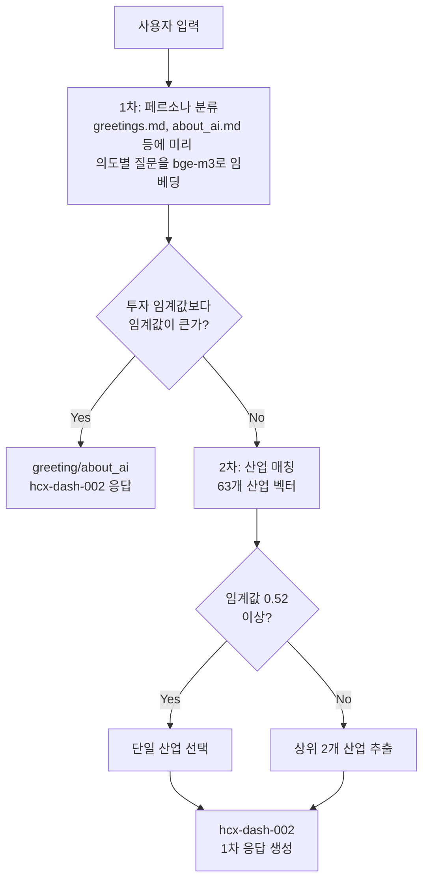
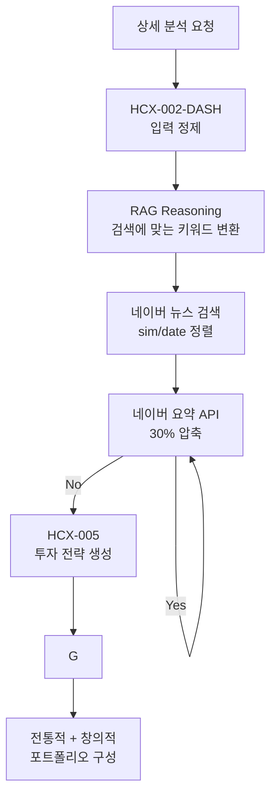
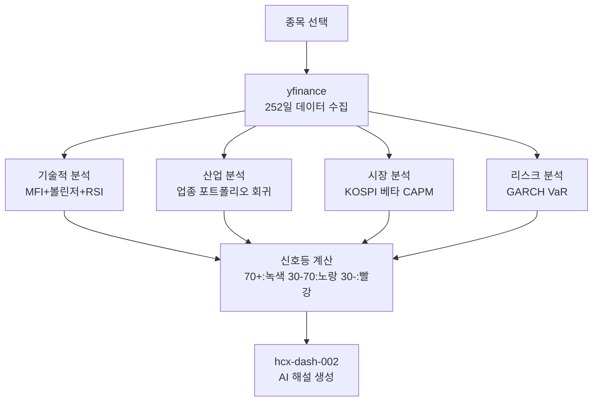
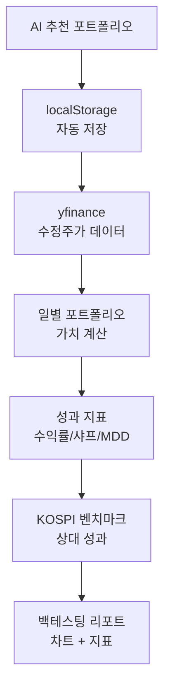

### AI를 통해 수정된 readme.md입니다 ###


# 🚀 AI Festival 투자지원 플랫폼


**Clova Studio 기반 AI가 제공하는 차세대 투자 분석 플랫폼**

사용자가 막연한 아이디어를 기반으로 자연어로 질문하면 AI가 2단계 RAG 시스템과 4중 분석을 통해 맞춤형 투자 전략을 제안하는 플랫폼입니다.

## 🎯 4가지 핵심 기능

### 🔍 1. 1차:  RAG 기반 2단계 의도 파악
- **2단계 RAG 시스템**: 페르소나 분류 → 산업 매칭의 이중 검증
- **Clova Studio bge-m3 임베딩**: 기분류된 KOSPI 산업과 정확한 매칭
- **hcx-dash-002 모델**: 빠른 1차 응답 생성 (120토큰, 온도 0.7)
- **상위 2개 산업 추출**: 정확도 0.65 미만 시 Top 2 산업을 언급하고, 2차 응답에 정보를 모두 제공
- **실시간 의도 분류**: greeting, about_ai, investment_query, casual_chat 자동 분류

### 📰 2. 2차:  뉴스 기반 전략 도출
- **HCX-005 Function Calling**: 고급 모델의 자율적 뉴스 검색 및 분석
- **사용자 입력 정제**: 비정형 질문을 구체적 투자 쿼리로 변환
- **네이버 뉴스 API**: 최근 n일간 관련 뉴스 수집 (sim/date 기준 정렬)
- **자동 요약**: 2000자 이상 뉴스 시 네이버 요약 API 호출 (30% 정도 토큰을 절약함)
- **투자 전략 생성**: 정통적 + 창의적 전략 조합으로 포트폴리오 구성

### 📈 3. 포트폴리오 백테스팅
- **yfinance 실제 데이터**: 수정주가 기준 3m, 6m, 1y 백테스팅 기능
- **자동 포트폴리오 저장**: AI 추천 결과를 즉시 저장
- **성과 지표 계산**: 누적수익률, 연환산수익률, 샤프비율, 최대낙폭

### ⚡ 4. SpeedTraffic™ 개별 기업 분석
- **4중 분석 시스템**: 기술적/산업/시장/리스크 영역별 신호등 UI 시스템
- **기술적 분석**: MFI(14일) + 볼린저밴드(20일,2σ) + RSI(14일) 다수결 원칙
- **산업 분석**: 동일 업종 포트폴리오 회귀분석으로 업종 베타 계산
- **시장 분석**: KOSPI 대비 CAPM 베타 및 기대수익률 산출
- **리스크 분석**: GARCH(1,1) 모델 기반 변동성 예측 및 95% VaR
- **AI 해설**: hcx-dash-002 모델의 전문적 분석 결과 해설

## 🏗️ 하이브리드 아키텍처

### 🔧 기술 스택
- **프론트엔드**: Next.js 15, React 18, TypeScript 5.0, Tailwind CSS
- **백엔드**: Node.js API Routes (14개), Python 분석 서비스 (10개)
- **사용한 Naver Clova Studio 툴**:
  - **hcx-dash-002**: 1차 응답, Speedtraffic 해설 생성 (Clova Studio)
  - **HCX-005**: Function Calling, 상세 분석 (Clova Studio)
  - **bge-m3**: 임베딩 생성 (Clova Studio)
  - **RAG Reasoning**: 검색 전 검색 의도 파악과 검색 쿼리 생성
  - **요약 API**: 방대한 뉴스 기사 요약

- **데이터**: 
  - 산업군 분류 지도 백터 : 

### 🧩 모듈화된 AI 채팅 시스템 (13개 파일)
```
src/lib/ai-chat/
├── types.ts                    # TypeScript 인터페이스 정의
├── config.ts                   # RAG 임계값, 모델 설정, 시스템 프롬프트
├── session-manager.ts          # 대화 히스토리 및 세션 관리
├── ai-service.ts              # Clova Studio API 클라이언트 및 응답 생성
├── rag-service.ts             # 2차 RAG: 페르소나 분류 → 산업 매칭
├── news-service.ts            # 네이버 뉴스 API 검색 및 필터링
├── summary-service.ts         # 네이버 요약 API 호출
├── function-calling-tools.ts  # HCX-005 Function Calling 도구 정의
├── company-utils.ts           # KOSPI 기업 조회 및 패턴 매칭
├── pipeline-handlers.ts       # 의도별 파이프라인 라우팅
├── request-handler.ts         # 메인 요청 오케스트레이션
├── speedtraffic-prompts.ts    # SpeedTraffic 분석용 프롬프트
└── index.ts                   # 모듈 진입점
```

### 🐍 Python 분석 엔진 (10개 파일)
```
api/python/
├── unified_analysis.py       # SpeedTraffic 통합 분석 메인
├── backtest.py               # yfinance 데이터 기반 포트폴리오 백테스팅
├── mfi_analysis.py           # Money Flow Index 기술적 분석
├── bollinger_analysis.py     # 볼린저 밴드 기술적 분석
├── rsi_analysis.py           # RSI 기술적 분석
├── industry_analysis.py      # 산업 포트폴리오 회귀 분석
├── capm_analysis.py          # CAPM 시장 베타 분석
├── garch_analysis.py         # GARCH 변동성 및 VaR 분석
├── unified_analysis_vercel.py # Vercel 서버리스 최적화 버전
└── backtest_vercel.py        # Vercel 백테스팅 최적화 버전
```
 
## 🛠️ 설치 및 실행

### 📋 필수 요구사항
- **Node.js** 18.0 이상
- **Python** 3.8 이상
- **Clova Studio API 키** (네이버 클라우드 플랫폼)
- **네이버 뉴스 API 키**
- **네이버 요약 API 키**

### 🚀 설치 및 설정
1. **저장소 클론**
   ```bash
   git clone https://github.com/Plokies-2/AIfestival.git
   cd AIfestival
   ```

2. **Node.js 의존성 설치**
   ```bash
   npm install
   ```

3. **Python 패키지 설치**
   ```bash
   pip install -r requirements.txt
   # 주요 패키지: yfinance, pandas, numpy
   ```

4. **환경 변수 설정**
   ```bash
   # .env.local 파일 생성
   CLOVA_STUDIO_API_KEY=your_clova_studio_api_key
   NAVER_NEWS_CLIENT_ID=your_naver_news_client_id
   NAVER_NEWS_CLIENT_SECRET=your_naver_news_client_secret
   NCP_API_KEY_ID=your_naver_summary_client_id
   NCP_API_KEY=your_naver_summary_client_secret
   ```

### 로컬 실행
```bash
npm run dev
```
브라우저에서 `http://localhost:3000`에 접속하여 플랫폼을 이용할 수 있습니다. **여러 개를 동시 실행해 포트가 3001 이상이 되면 일부 기능에 버그기 생깁니다**

## 🔄 파이프라인

### 🔍 1차 RAG 기반 산업 매칭 파이프라인


### 📰 2차 뉴스 기반 전략 도출 파이프라인


### ⚡ SpeedTraffic™ 4중 분석 파이프라인


### 📈 포트폴리오 백테스팅 파이프라인


## 📊 핵심 기술 세부사항

### 🎯 RAG 시스템 정확도 관리
- **2단계 검증**: 페르소나 분류(임계값 0.7) → 산업 매칭(임계값 0.65)
- **다중 매칭 로직**: 최고 점수 < 0.65일 경우 상위 2개 산업 추출
- **임베딩 모델**: Clova Studio bge-m3 (1024차원 벡터)
- **유사도 계산**: 정규화된 코사인 유사도

### 📰 뉴스 수집 및 처리 알고리즘
- **수집 기준**: 유사도(sim) 우선, 날짜(date) 보조 정렬 - date 정렬하면 빈약한 뉴스가 너무 많이 들어옴
- **수집 기간**: 기본 7일, 수집량에 따라 최대 30일
- **요약 임계값**: 2000자 이상 시 네이버 요약 API 호출

### ⚡ SpeedTraffic™ 분석 파라미터
- **데이터 기간**: 252일 (1년)
- **기술적 지표**: MFI(14일), 볼린저밴드(20일, 2σ), RSI(14일)
- **신호등 임계값**: 녹색(70+), 노랑(30-70), 빨강(30-)
- **종합 점수**: 4개 영역 가중평균 (기술적 30%, 산업 25%, 시장 25%, 리스크 20%)

### 📈 백테스팅
- **데이터 소스**: yfinance (실제 거래 데이터)
- **수익률 기준**: 수정주가 (배당, 액면분할 반영)
- **포트폴리오**: AI는 한 답변의 2개의 포트폴리오를 제공하며, 각각의 포트폴리오에 대해 백테스팅 하거나 둘을 한꺼번에 백테스팅 가능.


## 📁 완전한 프로젝트 구조 (총 56개 파일)

```
src/
├── components/ (9개)           # React UI 컴포넌트
│   ├── AIChat.tsx             # 🔥 메인 AI 채팅 인터페이스
│   ├── FinancialChart.tsx     # 🔥 실시간 주가 차트 (lightweight-charts)
│   ├── SpeedTraffic.tsx       # 🔥 SpeedTraffic 분석 백그라운드 실행
│   ├── SpeedTrafficLights.tsx # 🔥 4중 신호등 UI 및 종합 신호 계산
│   ├── LandingPageNew.tsx     # 랜딩 페이지 (4가지 기능 소개)
│   ├── RealTimeThinkingBox.tsx # AI 추론 과정 실시간 표시(뉴스 내용 요약 중... 이 표시되는 박스)
│   ├── MarketStatus.tsx       # 시장 현황 (KOSPI, KRW/USD, VIX)
│   └── ReportModal.tsx        # SpeedTraffic 보고서 모달
├── data/ (4개)                # 핵심 데이터
│   ├── KOSPI_companies.json   # 🔥 KOSPI 기업 데이터
│   ├── kospi_enriched_final.ts # 🔥 기업 정보 빠른 조회용
│   ├── kospi_industry_vectors.ts # 🔥 산업 키워드 벡터(산업 분류에 사용됩니다)
│   └── KOSPI_industry_mapping.json # 산업 매핑 정보
├── lib/ (4개)                 # 핵심 라이브러리
│   ├── clova-embedding.ts     # 🔥 Clova Studio bge-m3 임베딩
│   ├── embeddings.ts          # 🔥 임베딩 캐시 및 코사인 유사도
│   ├── server-session.ts      # 서버 세션 관리
│   └── utils.ts               # Tailwind 유틸리티
├── lib/ai-chat/ (13개)        # 🔥 모듈화된 AI 채팅 시스템
│   ├── ai-service.ts          # 🔥 Clova Studio API 클라이언트
│   ├── rag-service.ts         # 🔥 2단계 RAG 시스템 핵심
│   ├── function-calling-tools.ts # 🔥 HCX-005 Function Calling
│   ├── news-service.ts        # 🔥 네이버 뉴스 검색
│   ├── summary-service.ts     # 🔥 네이버 요약 API
│   ├── pipeline-handlers.ts   # 🔥 의도별 파이프라인 라우팅
│   ├── config.ts              # RAG 임계값, 모델 설정
│   ├── types.ts               # TypeScript 타입 정의
│   ├── request-handler.ts     # 메인 요청 오케스트레이션
│   ├── session-manager.ts     # 대화 히스토리 관리
│   ├── company-utils.ts       # 기업 조회 유틸리티
│   ├── speedtraffic-prompts.ts # SpeedTraffic 프롬프트
│   └── index.ts               # 모듈 진입점
├── pages/api/ (14개)          # API 엔드포인트
│   ├── ai_chat.ts             # 🔥 메인 AI 채팅 API
│   ├── ai_chat_detailed.ts    # 🔥 HCX-005 상세 분석 API
│   ├── speedtraffic_analysis.ts # 🔥 SpeedTraffic 분석 API
│   ├── backtest.ts            # 🔥 포트폴리오 백테스팅 API
│   ├── unified_analysis.ts    # 🔥 Python 분석 통합 실행 API
│   ├── analysis-progress.ts   # 실시간 진행 상황 API
│   ├── speedtraffic_commentary.ts # SpeedTraffic AI 해설 API
│   ├── realtime_chart_data.ts # 실시간 차트 데이터 API
│   ├── market_data.ts         # 시장 데이터 API
│   ├── server-status.ts       # 서버 상태 API
│   ├── csv_chart_data.ts      # CSV 차트 데이터 API
│   ├── generate_report.ts     # 보고서 생성 API
│   ├── speedtraffic_log.ts    # SpeedTraffic 로그 API
├── utils/ (2개)               # 유틸리티
│   ├── companyLookup.ts       # 🔥 기업 정보 조회 및 변환
│   └── resultsStorage.ts      # SpeedTraffic 결과 타입 정의
└── api/python/ (10개)         # 🔥 Python 분석 엔진
    ├── unified_analysis.py    # 🔥 SpeedTraffic 통합 분석 메인
    ├── backtest.py            # 🔥 yfinance 포트폴리오 백테스팅
    ├── mfi_analysis.py        # 🔥 Money Flow Index 분석
    ├── bollinger_analysis.py  # 🔥 볼린저 밴드 분석
    ├── rsi_analysis.py        # 🔥 RSI 분석
    ├── industry_analysis.py   # 🔥 산업 포트폴리오 회귀 분석
    ├── capm_analysis.py       # 🔥 CAPM 시장 베타 분석
    ├── garch_analysis.py      # 🔥 GARCH 변동성 VaR 분석
    ├── unified_analysis_vercel.py # Vercel 최적화 버전
    └── backtest_vercel.py     # Vercel 백테스팅 버전
```

## 🎯 차별화 포인트

### 🔬 **기술적 혁신**
- **2단계 RAG 시스템**: 페르소나 → 산업 매칭의 이중 검증으로 정확도 향상
- **하이브리드 아키텍처**: TypeScript + Python 최적 조합
- **실시간 Function Calling**: HCX-005 모델의 자율적 뉴스 분석
- **4중 분석 신호등**: 기술적/산업/시장/리스크 종합 평가

### 📊 **데이터 정확성**
- **실제 거래 데이터**: yfinance 수정주가 기반 백테스팅
- **KOSPI 완전 커버리지**: 4,454개 전체 상장 기업 분석
- **실시간 뉴스 연동**: 네이버 뉴스 API 기반 최신 정보

### 🚀 **사용자 경험**
- **즉시 응답**: hcx-dash-002 모델의 빠른 1차 응답
- **직관적 신호등**: 복잡한 분석을 색상으로 단순화
- **자동 포트폴리오 저장**: AI 추천 결과 즉시 저장 및 백테스팅 연동

## 🏆 개발 정보

**미레에셋 AI 페스티벌 2025** 출품작
- **개발자**: 송승은(뚝딱뚝딱), song75800@naver.com
- **GitHub**: https://github.com/Plokies-2/AIfestival

