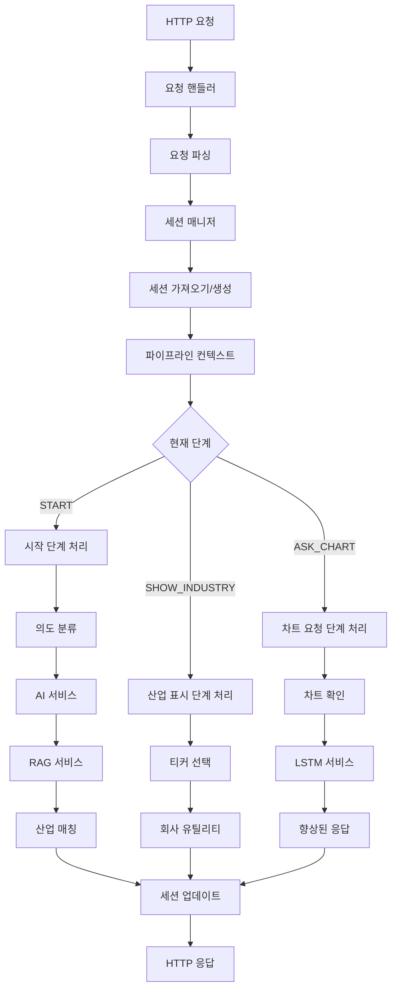

# AI 채팅 시스템 리팩토링 문서

## 개요

이 문서는 AI 채팅 시스템을 모놀리식 아키텍처에서 모듈화되고 유지보수 가능한 구조로 포괄적으로 리팩토링한 내용을 설명합니다. 이 리팩토링은 기존의 모든 기능을 보존하고 하위 호환성을 유지하면서 코드 구성, 유지보수성, 테스트 가능성을 개선합니다.

## 목차

1. [아키텍처 개요](#아키텍처-개요)
2. [모듈 구조](#모듈-구조)
3. [데이터 플로우 파이프라인](#데이터-플로우-파이프라인)
4. [모듈 책임](#모듈-책임)
5. [마이그레이션 가이드](#마이그레이션-가이드)
6. [이점 및 개선사항](#이점-및-개선사항)
7. [API 참조](#api-참조)
8. [테스트 및 검증](#테스트-및-검증)

## 아키텍처 개요

### 이전: 모놀리식 구조
```
src/pages/api/ai_chat.ts (1569줄)
├── 타입 정의
├── 설정 상수
├── 세션 관리
├── AI 서비스 통합
├── RAG 및 임베딩
├── LSTM 데이터 통합
├── 회사 유틸리티
├── 파이프라인 단계 핸들러
├── 요청 처리
└── 유틸리티 함수
```

**문제점:**
- 혼재된 책임을 가진 단일 파일
- 유지보수 및 디버깅의 어려움
- 개별 컴포넌트 테스트의 어려움
- 서로 다른 관심사 간의 강한 결합
- 코드 중복 및 불일치

### 이후: 모듈화된 구조
```
src/lib/ai-chat/
├── types.ts                    # 모든 TypeScript 인터페이스 및 타입
├── config.ts                   # 설정 상수 및 패턴
├── session-manager.ts          # 세션 상태 관리 및 정리
├── ai-service.ts              # OpenAI 통합 및 AI 응답
├── rag-service.ts             # RAG, 임베딩, 산업 매칭
├── lstm-service.ts            # LSTM 데이터 통합
├── company-utils.ts           # 회사 조회 및 유틸리티
├── pipeline-handlers.ts       # 단계별 로직 핸들러
├── request-handler.ts         # 메인 요청 오케스트레이션
└── index.ts                   # 공개 API 내보내기

src/pages/api/ai_chat.ts        # 얇은 래퍼 (79줄)
```

**이점:**
- 명확한 관심사 분리
- 단일 책임 원칙
- 테스트 및 유지보수 용이성
- 잘 정의된 인터페이스로 느슨한 결합
- 더 나은 코드 재사용성

## 모듈 구조

### 1. `types.ts` - 타입 정의
**목적:** 모듈 간 타입 일관성을 위한 중앙화된 TypeScript 타입 정의.

**주요 타입:**
- `LSTMData` - LSTM 예측 데이터 구조
- `SessionState` - 세션 상태 관리
- `IntentClassificationResult` - 사용자 의도 분류
- `ChatResponse` - API 응답 구조
- `PipelineContext` - 파이프라인 처리 컨텍스트

### 2. `config.ts` - 설정 관리
**목적:** 중앙화된 설정 상수, 패턴 및 설정.

**주요 설정:**
- `RAG_THRESHOLDS` - RAG 점수 임계값
- `PATTERNS` - 응답 매칭을 위한 정규식 패턴
- `OPENAI_CONFIG` - OpenAI API 설정
- `SESSION_CONFIG` - 세션 관리 설정
- `KOREAN_COMPANY_MAPPING` - 한국어-영어 회사명 매핑

### 3. `session-manager.ts` - 세션 관리
**목적:** 세션 상태, 정리 및 대화 기록 처리.

**주요 함수:**
- `getSession()` - 세션 상태 검색/생성
- `updateSession()` - 세션 상태 업데이트
- `cleanupOldSessions()` - 자동 세션 정리
- `addConversationEntry()` - 대화 기록 관리

### 4. `ai-service.ts` - AI 통합
**목적:** OpenAI API 상호작용 및 AI 기반 기능.

**주요 함수:**
- `classifyUserIntent()` - 패턴 및 GPT를 사용한 의도 분류
- `generatePersonaResponse()` - 페르소나 기반 응답 생성
- `classifyIndustryWithGPT()` - GPT 기반 산업 분류
- `translateDescription()` - 한국어-영어 번역

### 5. `rag-service.ts` - RAG 및 임베딩
**목적:** 검색 증강 생성, 산업 매칭 및 회사 찾기.

**주요 함수:**
- `findBestIndustry()` - 임베딩을 사용한 산업 매칭
- `findCompanyInAllData()` - 모든 데이터에서 회사 검색
- `getIndustryCompanies()` - 특정 산업의 회사 가져오기
- `testRAGThresholds()` - RAG 임계값 테스트

### 6. `lstm-service.ts` - LSTM 통합
**목적:** LSTM 예측 데이터 통합 및 향상.

**주요 함수:**
- `getLSTMDataForSymbol()` - 특정 심볼의 LSTM 데이터 가져오기
- `enhanceResponseWithLSTMData()` - LSTM 분석으로 응답 향상
- `checkLSTMServiceHealth()` - LSTM 서비스 상태 확인
- `formatLSTMDataForDisplay()` - 사용자 표시용 LSTM 데이터 포맷

### 7. `company-utils.ts` - 회사 유틸리티
**목적:** 회사 데이터 접근, 패턴 매칭 및 유틸리티 함수.

**주요 함수:**
- `isPositive()` / `isNegative()` - 사용자 응답의 패턴 매칭
- `getCompanyName()` - 안전한 회사명 조회
- `generateRandomRecommendation()` - 무작위 투자 추천
- `searchCompaniesByName()` - 회사 검색 기능

### 8. `pipeline-handlers.ts` - 단계 로직
**목적:** 대화 파이프라인의 단계별 로직.

**주요 함수:**
- `handleStartStage()` - START 단계 처리
- `handleShowIndustryStage()` - SHOW_INDUSTRY 단계 처리
- `handleAskChartStage()` - ASK_CHART 단계 처리

### 9. `request-handler.ts` - 요청 오케스트레이션
**목적:** 모든 모듈을 조정하고 HTTP 플로우를 처리하는 메인 오케스트레이터.

**주요 함수:**
- `handleChatRequest()` - 메인 요청 핸들러
- `processPipeline()` - 파이프라인 처리 조정
- `performHealthCheck()` - 시스템 상태 모니터링

### 10. `index.ts` - 공개 API
**목적:** 깔끔한 공개 API 내보내기 및 하위 호환성.

**내보내기:**
- 모든 공개 함수 및 타입
- 하위 호환성 내보내기
- 시스템 유틸리티 및 상태 확인

## 데이터 플로우 파이프라인



### 단계 플로우 세부사항

1. **START 단계:**
   - 의도 분류 (인사, 투자 질의 등)
   - RAG 임베딩을 사용한 산업 매칭
   - 회사 직접 검색
   - 투자 추천 생성

2. **SHOW_INDUSTRY 단계:**
   - 산업 내 회사 선택
   - "더보기" 기능
   - 티커 매칭 및 검증

3. **ASK_CHART 단계:**
   - 차트 확인 처리
   - LSTM 데이터 통합
   - 완료 후 세션 재설정

## 모듈 책임

### 핵심 원칙
각 모듈은 **단일 책임 원칙**을 따릅니다:

| 모듈 | 주요 책임 | 부차적 책임 |
|--------|----------------------|---------------------------|
| `types.ts` | 타입 정의 | 인터페이스 일관성 |
| `config.ts` | 설정 관리 | 상수 및 패턴 |
| `session-manager.ts` | 세션 생명주기 | 대화 기록, 정리 |
| `ai-service.ts` | AI API 통합 | 의도 분류, 응답 |
| `rag-service.ts` | 정보 검색 | 산업/회사 매칭 |
| `lstm-service.ts` | LSTM 데이터 통합 | 예측 향상 |
| `company-utils.ts` | 회사 운영 | 패턴 매칭, 유틸리티 |
| `pipeline-handlers.ts` | 단계 로직 | 대화 플로우 제어 |
| `request-handler.ts` | 요청 오케스트레이션 | HTTP 처리, 조정 |
| `index.ts` | 공개 API | 내보내기 및 호환성 |

### 의존성 그래프
```
request-handler.ts
├── session-manager.ts
├── pipeline-handlers.ts
│   ├── ai-service.ts
│   ├── rag-service.ts
│   ├── lstm-service.ts
│   └── company-utils.ts
├── types.ts
└── config.ts
```

## 마이그레이션 가이드

### 호환성 깨짐
**없음** - 리팩토링은 완전한 하위 호환성을 유지합니다.

### API 호환성
외부 API 인터페이스는 동일하게 유지됩니다:

```typescript
// 이전과 이후 - 동일한 인터페이스
export default async function handler(req: NextApiRequest, res: NextApiResponse) {
  // 구현은 변경되었지만 인터페이스는 보존됨
}

export const config = { api: { bodyParser: { sizeLimit: '1mb' } } };
```

### 임포트 변경
내부 사용을 위해 이제 더 구체적인 임포트가 가능합니다:

```typescript
// 이전 (모놀리식)
import { /* 하나의 파일에서 모든 것 */ } from './ai_chat';

// 이후 (모듈화)
import { classifyUserIntent } from '@/lib/ai-chat/ai-service';
import { getSession } from '@/lib/ai-chat/session-manager';
import { findBestIndustry } from '@/lib/ai-chat/rag-service';

// 또는 공개 API 사용
import { classifyUserIntent, getSession, findBestIndustry } from '@/lib/ai-chat';
```

### 설정 마이그레이션
설정이 이제 중앙화되고 타입이 지정됩니다:

```typescript
// 이전 (분산된 상수)
const RAG_THRESHOLDS = { /* ... */ };
const PATTERNS = { /* ... */ };

// 이후 (중앙화된 설정)
import { RAG_THRESHOLDS, PATTERNS } from '@/lib/ai-chat/config';
```

## 이점 및 개선사항

### 1. 유지보수성
- **이전:** 1569줄의 모놀리식 파일
- **이후:** 9개의 집중된 모듈 (평균 200-300줄)
- **이점:** 문제 위치 파악 및 수정 용이

### 2. 테스트 가능성
- **이전:** 개별 컴포넌트 테스트 어려움
- **이후:** 각 모듈을 독립적으로 테스트 가능
- **이점:** 더 나은 테스트 커버리지 및 신뢰성

### 3. 코드 재사용성
- **이전:** 단일 파일 내에서 강하게 결합된 함수
- **이후:** 명확한 인터페이스를 가진 모듈화된 함수
- **이점:** 다양한 컨텍스트에서 컴포넌트 재사용 가능

### 4. 타입 안전성
- **이전:** 파일 전체에 혼재된 타입 정의
- **이후:** 중앙화되고 포괄적인 타입 시스템
- **이점:** 더 나은 IDE 지원 및 컴파일 타임 오류 감지

### 5. 성능
- **이전:** 모든 코드가 함께 로드됨
- **이후:** 트리 셰이킹 가능성이 있는 모듈화된 로딩
- **이점:** 더 작은 번들 크기 및 빠른 로딩

### 6. 개발자 경험
- **이전:** 탐색 및 이해 어려움
- **이후:** 명확한 모듈 경계 및 문서화
- **이점:** 빠른 온보딩 및 개발

### 7. 오류 처리
- **이전:** 일관성 없는 오류 처리 패턴
- **이후:** 중앙화된 오류 타입 및 일관된 처리
- **이점:** 더 나은 디버깅 및 사용자 경험

## API 참조

### 메인 핸들러
```typescript
import { handleChatRequest } from '@/lib/ai-chat';

// Next.js API 라우트에서 사용
export default async function handler(req: NextApiRequest, res: NextApiResponse) {
  await handleChatRequest(req, res);
}
```

### 세션 관리
```typescript
import { getSession, updateSession, resetSession } from '@/lib/ai-chat';

const session = getSession(sessionId);
updateSession(sessionId, newState);
resetSession(sessionId);
```

### AI 서비스
```typescript
import { classifyUserIntent, generatePersonaResponse } from '@/lib/ai-chat';

const intent = await classifyUserIntent(userInput);
const response = await generatePersonaResponse(userInput, intent.intent);
```

### RAG 서비스
```typescript
import { findBestIndustry, findCompanyInAllData } from '@/lib/ai-chat';

const industry = await findBestIndustry(userInput);
const company = findCompanyInAllData(userInput);
```

### LSTM 서비스
```typescript
import { getLSTMDataForSymbol, enhanceResponseWithLSTMData } from '@/lib/ai-chat';

const lstmData = await getLSTMDataForSymbol(symbol);
const enhancedResponse = await enhanceResponseWithLSTMData(companies, response);
```

## 테스트 및 검증

### 단위 테스트
이제 각 모듈을 독립적으로 테스트할 수 있습니다:

```typescript
// 예시: AI 서비스 테스트
import { classifyUserIntent } from '@/lib/ai-chat/ai-service';

describe('AI Service', () => {
  test('should classify greeting intent', async () => {
    const result = await classifyUserIntent('안녕하세요');
    expect(result.intent).toBe('greeting');
    expect(result.confidence).toBeGreaterThan(0.9);
  });
});
```

### 통합 테스트
모듈 상호작용 테스트:

```typescript
// 예시: 파이프라인 플로우 테스트
import { handleStartStage } from '@/lib/ai-chat/pipeline-handlers';

describe('Pipeline Handlers', () => {
  test('should handle investment query', async () => {
    const context = createTestContext('반도체 투자');
    const result = await handleStartStage(context);
    expect(result.newState.stage).toBe('SHOW_INDUSTRY');
  });
});
```

### 상태 확인
시스템 상태 모니터링:

```typescript
import { performHealthCheck } from '@/lib/ai-chat';

const health = await performHealthCheck();
console.log('System status:', health.status);
console.log('Component checks:', health.checks);
```

### 검증
시스템 설정 검증:

```typescript
import { validateSystemConfiguration } from '@/lib/ai-chat';

const validation = validateSystemConfiguration();
if (!validation.isValid) {
  console.error('Configuration errors:', validation.errors);
}
```

---

## 결론

AI 채팅 시스템 리팩토링은 유지보수가 어려운 모놀리식 코드베이스를 깔끔하고 모듈화된 아키텍처로 성공적으로 변환했습니다. 새로운 구조는 다음을 제공합니다:

- **집중된 모듈을 통한 더 나은 유지보수성**
- **격리된 컴포넌트로 향상된 테스트 가능성**
- **명확한 인터페이스로 향상된 개발자 경험**
- **호환성 깨짐 없이 보존된 기능**
- **모듈화된 설계를 통한 미래 확장성**

이 리팩토링은 현재 시스템을 훨씬 더 쉽게 작업하고 유지보수할 수 있게 만들면서 미래 개선을 위한 견고한 기반을 구축합니다.
